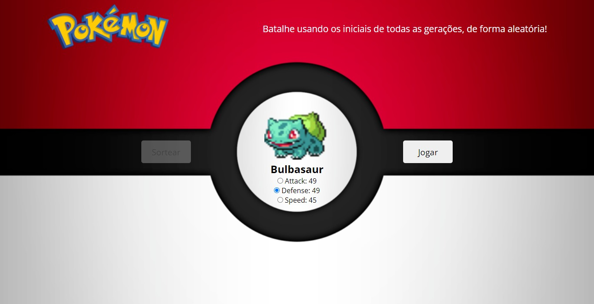

# Random Pokébattle - Imersão Dev

Um minigame de "batalhas" pokémon aleatórias, baseado no Super Trunfo da Imersão Dev.

## Conteúdos

- [Overview](#overview)
  - [O projeto](#o-projeto)
  - [Screenshot](#screenshot)
  - [Links](#links)
- [Processo](#processo)
  - [Feito com](#feito-com)

- [Autor](#autor)

## Overview

### O projeto

- Como dito, este é um projeto baseado no Super Trunfo. A proposta da escolha aleatória de personagem e uso de atributos permaneceu, porém, quase todo o restante tem uma cara mais minha.

### Screenshot

### Links

- [URL do Site](https://luizhf42.github.io/random-pokebattle)

## Processo

### Feito com

- HTML5
- CSS3
- Flexbox
- JavaScript

## Autor

- Propriamente eu, Luiz Henrique.
